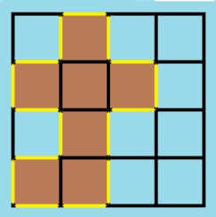

# 463.岛屿的周长
> https://leetcode-cn.com/problems/island-perimeter/
> 
> 难度：简单

## 题目：

给定一个 row x col 的二维网格地图 grid ，其中：grid[i][j] = 1 表示陆地， grid[i][j] = 0 表示水域。

网格中的格子 水平和垂直 方向相连（对角线方向不相连）。整个网格被水完全包围，但其中恰好有一个岛屿（或者说，一个或多个表示陆地的格子相连组成的岛屿）。

岛屿中没有“湖”（“湖” 指水域在岛屿内部且不和岛屿周围的水相连）。格子是边长为 1 的正方形。网格为长方形，且宽度和高度均不超过 100 。计算这个岛屿的周长。

## 示例：

示例 1：


输入：grid = [[0,1,0,0],[1,1,1,0],[0,1,0,0],[1,1,0,0]]

输出：16

解释：它的周长是上面图片中的 16 个黄色的边

示例 2：

输入：grid = [[1]]

输出：4

示例 3：

输入：grid = [[1,0]]

输出：4


## 分析


## 解题：

```python
class Solution:
    def islandPerimeter(self, grid):
        ret = 0
        row = len(grid)
        col = len(grid[0])
        distances = [(-1, 0), (1, 0), (0, 1), (0, -1)]
        for i in range(row):
            for j in range(col):
                if grid[i][j] == 0:
                    continue
                nums = 4
                for distance in distances:
                    new_x, new_y = i + distance[0], j + distance[1]
                    if 0 <= new_x < row and 0 <= new_y < col and grid[new_x][new_y] == 1:
                        nums -= 1
                ret += nums
        return ret
```

欢迎关注我的公众号: **清风Python**，带你每日学习Python算法刷题的同时，了解更多python小知识。

有喜欢力扣刷题的小伙伴可以加我微信（King_Uranus）互相鼓励，共同进步，一起玩转超级码力！

我的个人博客：[https://qingfengpython.cn](https://qingfengpython.cn)

力扣解题合集：[https://github.com/BreezePython/AlgorithmMarkdown](https://github.com/BreezePython/AlgorithmMarkdown)