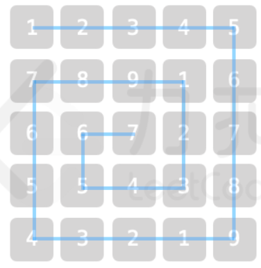

# 2. 乐团站位
> 
> 
> 难度：简单

## 题目：

某乐团的演出场地可视作 num * num 的二维矩阵 grid（左上角坐标为 [0,0])，每个位置站有一位成员。乐团共有 9 种乐器，乐器编号为 1~9，每位成员持有 1 个乐器。

为保证声乐混合效果，成员站位规则为：自 grid 左上角开始顺时针螺旋形向内循环以 1，2，...，9 循环重复排列。例如当 num = 5 时，站位如图所示



请返回位于场地坐标 [Xpos,Ypos] 的成员所持乐器编号。

提示：

1 <= num <= 10^9

0 <= Xpos, Ypos < num

## 示例：

示例 1：

输入：num = 3, Xpos = 0, Ypos = 2

输出：3

解释：


示例 2：

输入：num = 4, Xpos = 1, Ypos = 2

输出：5


## 分析


## 解题：

```python
class Solution:
    def orchestraLayout(self, num, xPos, yPos):
        rounds = min(xPos, yPos, num - 1 - xPos, num - 1 - yPos)
        inner = num - 2 * rounds
        res = num ** 2 - inner ** 2

        xPos -= rounds
        yPos -= rounds
        print(xPos, yPos, inner, res)
        while (xPos != 0):
            res += inner - 1
            xPos, yPos = inner - 1 - yPos, xPos

        res += yPos
        print(res)
        return res % 9 + 1
```

欢迎关注我的公众号: **清风Python**，带你每日学习Python算法刷题的同时，了解更多python小知识。

有喜欢力扣刷题的小伙伴可以加我微信（King_Uranus）互相鼓励，共同进步，一起玩转超级码力！

我的个人博客：[https://qingfengpython.cn](https://qingfengpython.cn)

力扣解题合集：[https://github.com/BreezePython/AlgorithmMarkdown](https://github.com/BreezePython/AlgorithmMarkdown)
