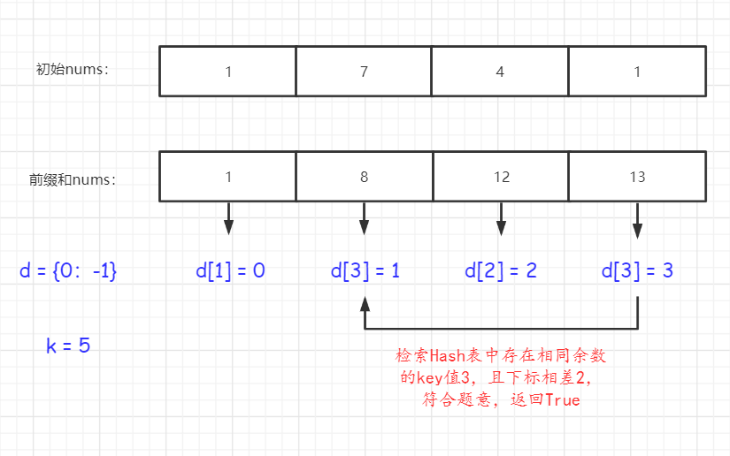

# [523.连续的子数组和](https://leetcode-cn.com/problems/continuous-subarray-sum/solution/523-lian-xu-de-zi-shu-zu-he-qian-zhui-he-zl78/)
> https://leetcode-cn.com/problems/continuous-subarray-sum/solution/523-lian-xu-de-zi-shu-zu-he-qian-zhui-he-zl78/
> 
> 难度：中等

## 题目：

给你一个整数数组 nums 和一个整数 k ，编写一个函数来判断该数组是否含有同时满足下述条件的连续子数组：

- 子数组大小 至少为 2 ，且
- 子数组元素总和为 k 的倍数。
如果存在，返回 true ；否则，返回 false 。

如果存在一个整数 n ，令整数 x 符合 x = n * k ，则称 x 是 k 的一个倍数。

提示：

- 1 <= nums.length <= 105
- 0 <= nums[i] <= 109
- 0 <= sum(nums[i]) <= 231 - 1
- 1 <= k <= 231 - 1
- 通过次数39,014提交次数161,45

## 示例：

```
示例 1：
输入：nums = [23,2,4,6,7], k = 6
输出：true
解释：[2,4] 是一个大小为 2 的子数组，并且和为 6 。

示例 2：
输入：nums = [23,2,6,4,7], k = 6
输出：true
解释：[23, 2, 6, 4, 7] 是大小为 5 的子数组，并且和为 42 。 
42 是 6 的倍数，因为 42 = 7 * 6 且 7 是一个整数。

示例 3：
输入：nums = [23,2,6,4,7], k = 13
输出：false
```

## 分析
首先，看到几项的和为条件判断，那么首先改考虑前缀和了。

然后，这道题引入了一个概念 **同余定理**：

`即当两个数除以某个数的余数相等，那么二者相减后肯定可以被该数整除`。

由于采取前缀和的方式进行判断，所以后面的数字总和必然包含它之前的内容。此时，我们维护一个Hash表，
记录{余数 : 下标}，由于可能存在nums前N个数字和恰好被K整除的情况，我们预制字典{0,-1}来规避该问题。
如图所示：




最后在说下，前缀和不是一定要把列表循环一遍，更新列表每个字段为前缀和内容后再二次判断。
这种场景出现在需要多次循环列表的情况。如果像类似这道题的场景，我们只需要维护一个初始值为0的数字，每次加等即可。

## 解题：

```python
class Solution:
    def checkSubarraySum(self, nums, k):
        d = {0: -1}
        pre = 0
        for index, num in enumerate(nums):
            pre += num
            rem = pre % k
            i = d.get(rem, index)
            if i == index:
                d[rem] = index
            elif i <= index - 2:
                return True
        return False
```

欢迎关注我的公众号: **清风Python**，带你每日学习Python算法刷题的同时，了解更多python小知识。

有喜欢力扣刷题的小伙伴可以加我微信（King_Uranus）互相鼓励，共同进步，一起玩转超级码力！

我的个人博客：[https://qingfengpython.cn](https://qingfengpython.cn)

力扣解题合集：[https://github.com/BreezePython/AlgorithmMarkdown](https://github.com/BreezePython/AlgorithmMarkdown)
