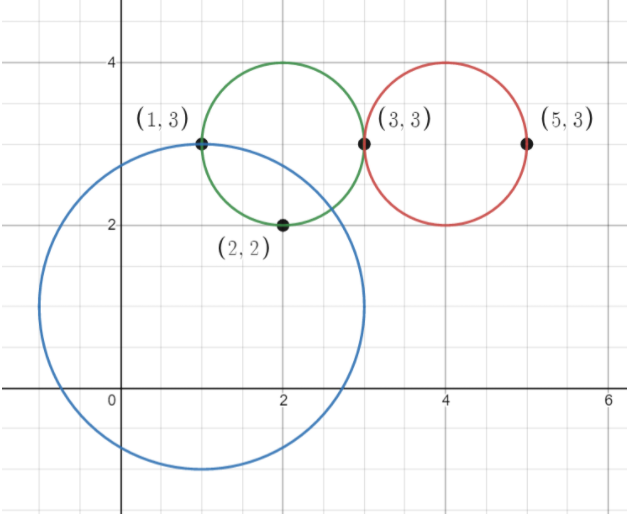

# [1828.统计一个圆中点的数目](https://leetcode-cn.com/problems/queries-on-number-of-points-inside-a-circle/)
> https://leetcode-cn.com/problems/queries-on-number-of-points-inside-a-circle/
> 
> 难度：中等

## 题目：

给你一个数组 points ，其中 points[i] = [xi, yi] ，表示第 i 个点在二维平面上的坐标。多个点可能会有 相同 的坐标。

同时给你一个数组 queries ，其中 queries[j] = [xj, yj, rj] ，表示一个圆心在 (xj, yj) 且半径为 rj 的圆。

对于每一个查询 queries[j] ，计算在第 j 个圆 内 点的数目。如果一个点在圆的 边界上 ，我们同样认为它在圆 内 。

请你返回一个数组 answer ，其中 answer[j]是第 j 个查询的答案。

提示：

1 <= points.length <= 500
points[i].length == 2
0 <= xi, yi <= 500
1 <= queries.length <= 500
queries[j].length == 3
0 <= xj, yj <= 500
1 <= rj <= 500
所有的坐标都是整数。

## 示例：

示例 1：



输入：points = [[1,3],[3,3],[5,3],[2,2]], queries = [[2,3,1],[4,3,1],[1,1,2]]
输出：[3,2,2]
解释：所有的点和圆如上图所示。
queries[0] 是绿色的圆，queries[1] 是红色的圆，queries[2] 是蓝色的圆。
示例 2：


输入：points = [[1,1],[2,2],[3,3],[4,4],[5,5]], queries = [[1,2,2],[2,2,2],[4,3,2],[4,3,3]]
输出：[2,3,2,4]
解释：所有的点和圆如上图所示。
queries[0] 是绿色的圆，queries[1] 是红色的圆，queries[2] 是蓝色的圆，queries[3] 是紫色的圆。
 


## 分析

竞赛比较紧急，拿暴力法解题的，后续在想简便方式吧

## 解题：

```python
class Solution:
    def countPoints(self, points, queries):
        ret = []
        for i in queries:
            x, y, r = i
            tmp = 0
            for j in points:
                a, b = j
                if (y - b) ** 2 + (x - a) ** 2 <= r ** 2:
                    tmp += 1
            ret.append(tmp)
        return ret

```

欢迎关注我的公众号: **清风Python**，带你每日学习Python算法刷题的同时，了解更多python小知识。

有喜欢力扣刷题的小伙伴可以加我微信（King_Uranus）互相鼓励，共同进步，一起玩转超级码力！

我的个人博客：[https://qingfengpython.cn](https://qingfengpython.cn)

力扣解题合集：[https://github.com/BreezePython/AlgorithmMarkdown](https://github.com/BreezePython/AlgorithmMarkdown)
