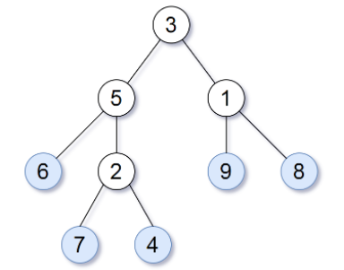

# 872.叶子相似的树
> https://leetcode-cn.com/problems/leaf-similar-trees/
> 
> 难度：简单

## 题目：

请考虑一棵二叉树上所有的叶子，这些叶子的值按从左到右的顺序排列形成一个 叶值序列 。



举个例子，如上图所示，给定一棵叶值序列为(6, 7, 4, 9, 8)的树。

如果有两棵二叉树的叶值序列是相同，那么我们就认为它们是叶相似的。

如果给定的两个根结点分别为root1 和root2的树是叶相似的，则返回true；否则返回 false 。

## 示例：

```
示例 1：

输入：root1 = [3,5,1,6,2,9,8,null,null,7,4], root2 = [3,5,1,6,7,4,2,null,null,null,null,null,null,9,8]
输出：true

示例 2：

输入：root1 = [1], root2 = [1]
输出：true

示例 3：

输入：root1 = [1], root2 = [2]
输出：false

示例 4：

输入：root1 = [1,2], root2 = [2,2]
输出：true

示例 5：

输入：root1 = [1,2,3], root2 = [1,3,2]
输出：false
```

## 分析

二叉树搜索叶子结点，要求我们对深度优先的方法具备相关掌握即可完成解题。
在深度优先搜索的过程中，我们总是先搜索当前节点的左子节点，再搜索当前节点的右子节点。
这里由于要搜索两个二叉树的叶子结点，所以单独抽离出dfs方法，进行调用后判断结果

## 解题：

```python
# class TreeNode:
#     def __init__(self, val=0, left=None, right=None):
#         self.val = val
#         self.left = left
#         self.right = right

class Solution:
    def leafSimilar(self, root1: TreeNode, root2: TreeNode) -> bool:
        def dfs(root, ret):
            if not root.left and not root.right:
                ret.append(root.val)
                return
            if root.left:
                dfs(root.left, ret)
            if root.right:
                dfs(root.right, ret)

        ret1 = []
        dfs(root1, ret1)
        ret2 = []
        dfs(root2, ret2)
        return ret1 == ret2
```

欢迎关注我的公众号: **清风Python**，带你每日学习Python算法刷题的同时，了解更多python小知识。

有喜欢力扣刷题的小伙伴可以加我微信（King_Uranus）互相鼓励，共同进步，一起玩转超级码力！

我的个人博客：[https://qingfengpython.cn](https://qingfengpython.cn)

力扣解题合集：[https://github.com/BreezePython/AlgorithmMarkdown](https://github.com/BreezePython/AlgorithmMarkdown)