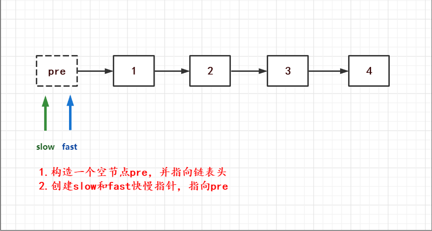
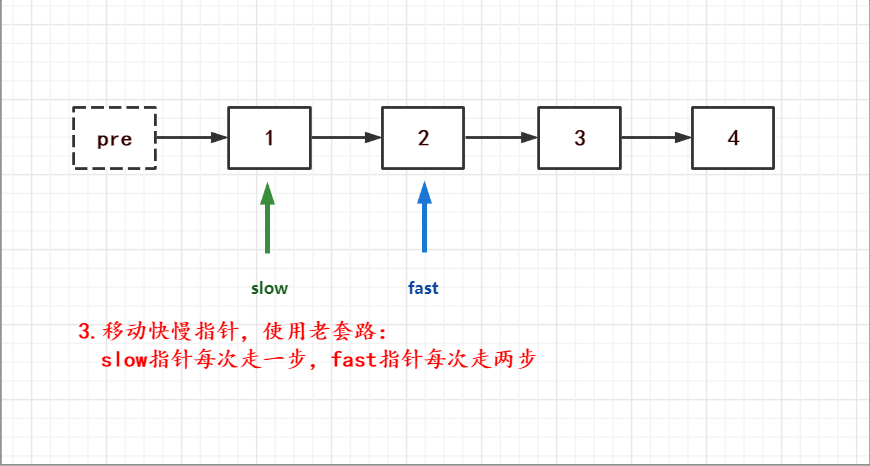
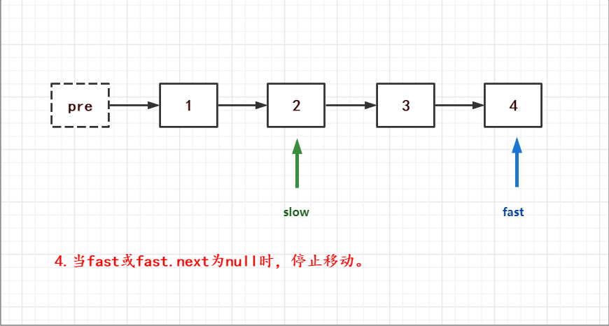
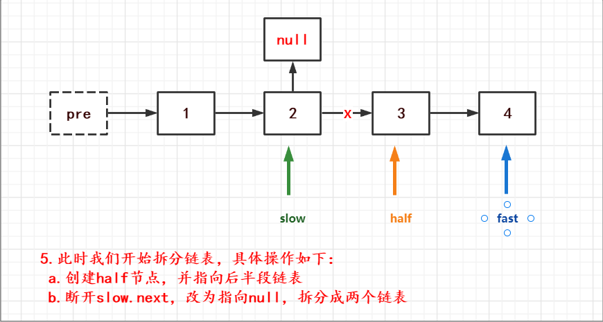
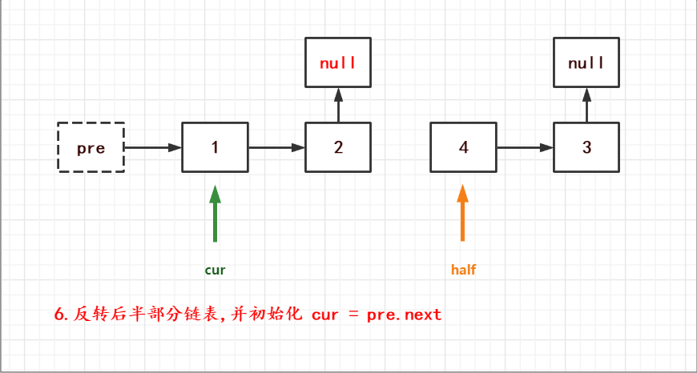
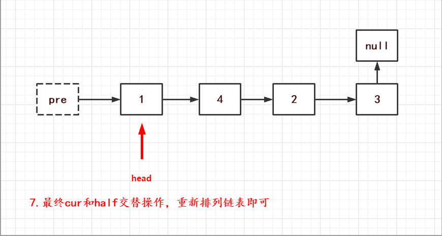

# [剑指OfferII026.重排链表](https://leetcode-cn.com/problems/LGjMqU/solution/shua-chuan-jian-zhi-offer-day13-lian-bia-chs7/)
> https://leetcode-cn.com/problems/LGjMqU/solution/shua-chuan-jian-zhi-offer-day13-lian-bia-chs7/
> 
> 难度：中等

## 题目
给定一个单链表 L 的头节点 head ，单链表 L 表示为：
L0→ L1→ … → Ln-1→ Ln
请将其重新排列后变为：
L0→Ln→L1→Ln-1→L2→Ln-2→ …

不能只是单纯的改变节点内部的值，而是需要实际的进行节点交换。

提示：
- 链表的长度范围为 [1, 5 * 104]
- 1 <= node.val <= 1000

## 示例
```
示例 1:
输入: head = [1,2,3,4]
输出: [1,4,2,3]
示例 2:
输入: head = [1,2,3,4,5]
输出: [1,5,2,4,3]
```

## 分析
如果是数组来做这道题，那真的是很简单，但偏偏它是链表你说气不气。
- [剑指offerII024.反转链表](https://leetcode-cn.com/problems/UHnkqh/solution/shua-chuan-jian-zhi-offer-day12-lian-bia-190d/)

然而，这道题还能无脑的去使用024的整体反转链表么？答案是不能，why...
因为如果我们无脑的去反转了链表那么会将链表从1->2->3->4,转化为4->3->2->1并未解决任何问题。
不知道大家在做链表题时，是否有和我一样的感觉： **这解法就摆在眼前，一看便知，但就是写不出来.**
写不出来怎么办？
1. 先考虑下咱们之前做过的链表题目有没有类似的。注意题目关键点，将链表对半分后进行了首尾添加。
2. 关于获取链表的一半，是不和之前咱们做过的快慢指针查找链表中间节点有关系？
3. 找到中间节点后，如果我们将后半部分链表逆序，然后把前半部分的链表与后半部分断开。
4. 这不就成了针对两个链表的合并题目了吗？
让我们画图整理下思路:







最终代码如下：
## 解题
**Python:**
```python
class Solution:
    def reverseList(self, head):
        pre, cur = None, head
        while cur:
            tmp = cur.next
            cur.next = pre
            pre, cur = cur, tmp
        return pre

    def reorderList(self, head: ListNode) -> None:
        pre = ListNode()
        pre.next = head
        slow = fast = pre
        while fast and fast.next:
            slow = slow.next
            fast = fast.next.next
        half = slow.next
        slow.next = None
        rev_half = self.reverseList(half)
        cur = pre.next
        while slow and rev_half:
            tmp = cur.next
            cur.next = rev_half
            cur = cur.next
            rev_half = rev_half.next
            cur.next = tmp
            cur = cur.next
```
**Java:**
```java
class Solution {
    private ListNode reverseList(ListNode head) {
        ListNode pre = null;
        ListNode cur = head;
        while (cur != null) {
            ListNode tmp = cur.next;
            cur.next = pre;
            pre = cur;
            cur = tmp;
        }
        return pre;
    }

    public void reorderList(ListNode head) {
        ListNode pre = new ListNode();
        ListNode slow = pre;
        ListNode fast = pre;
        pre.next = head;
        while (fast != null && fast.next != null) {
            slow = slow.next;
            fast = fast.next.next;
        }
        ListNode half = slow.next;
        slow.next = null;
        ListNode rev_half = this.reverseList(half);
        ListNode cur = pre.next;
        while (rev_half != null) {
            ListNode tmp = cur.next;
            cur.next = rev_half;
            cur = cur.next;
            rev_half = rev_half.next;
            cur.next = tmp;
            cur = cur.next;
        }
    }
}
```

欢迎关注我的公众号: **清风Python**，带你每日学习Python算法刷题的同时，了解更多python小知识。

有喜欢力扣刷题的小伙伴可以加我微信（King_Uranus）互相鼓励，共同进步，一起玩转超级码力！

我的个人博客：[https://qingfengpython.cn](https://qingfengpython.cn)

力扣解题合集：[https://github.com/BreezePython/AlgorithmMarkdown](https://github.com/BreezePython/AlgorithmMarkdown)