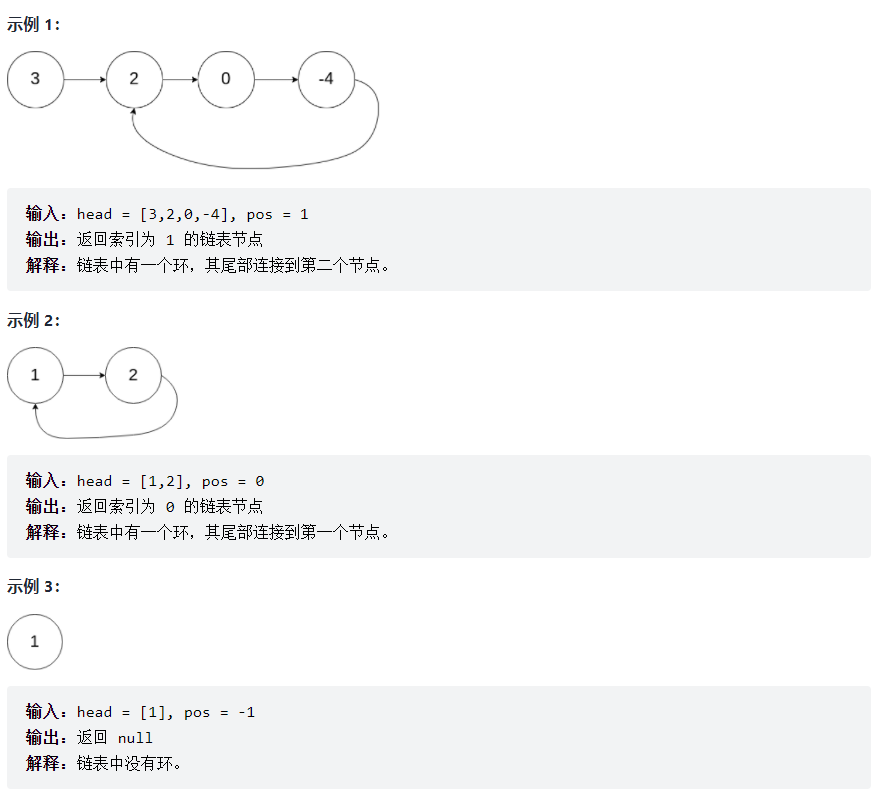
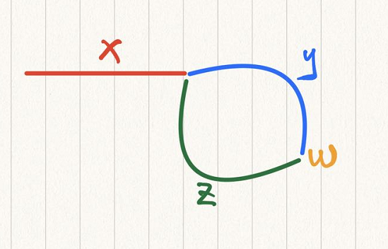

# [剑指offerII022.链表中环的入口节点](https://leetcode-cn.com/problems/c32eOV/solution/shua-chuan-jian-zhi-offer-day12-lian-bia-lv78/)
> https://leetcode-cn.com/problems/c32eOV/solution/shua-chuan-jian-zhi-offer-day12-lian-bia-lv78/
> 
> 难度：中等

## 题目

给定一个链表，返回链表开始入环的第一个节点。 从链表的头节点开始沿着 next 指针进入环的第一个节点为环的入口节点。如果链表无环，则返回 null。
为了表示给定链表中的环，我们使用整数 pos 来表示链表尾连接到链表中的位置（索引从 0 开始）。 如果 pos 是 -1，则在该链表中没有环。注意，pos 仅仅是用于标识环的情况，并不会作为参数传递到函数中。
说明：不允许修改给定的链表。

提示：
- 链表中节点的数目范围在范围 [0, 10 ^ 4] 内
- -10 ^ 5 <= Node.val <= 10 ^ 5
- pos 的值为 -1 或者链表中的一个有效索引 

进阶：是否可以使用 O(1) 空间解决此题？

## 示例


## 分析
- [141.环形链表](https://leetcode-cn.com/problems/linked-list-cycle/solution/141huan-xing-lian-biao-pythonji-he-yu-ku-1yuu/)

看过了141题的环形链表，相信我们对于判断环形链表已经没有什么问题了，但是这道题要我们求的是环形链表的入口节点，这又该如何解题呢？
之前就说了，遇到链表题画图是一个很好的解决办法。让我们画一个图，通过图形分析这道题吧。



假设快慢指针在W点相遇，此时慢指针走过的路程为x+y，快指针走过的路程为x+y+n(y+z)。
为什么慢指针走过y就必然与快指针相遇，而不是慢指针走过y+m(y+z)呢？
- 首先，由于快指针一定先进入环内，这点毋庸置疑。
- 而且，快指针是慢指针速度的二倍，即慢指针走完一圈，快指针可以走两圈
- 所以不论慢指针入环时，快指针在哪一点，快指针都可以在慢指针未走过一圈时追上慢指针。

而由于快指针走过的节点数是慢指针的二倍，所以得到公式：
(x + y) * 2 = x + y + n (y + z)
两边抵消 x+y，得到 x + y = n (y + z)
由于我们最终要求的是x，所以 x = n (y + z) - y
然而,此时慢指针所走过的路程刚好为y，如果此时有一个指针point从头开始走向环，即x路程
那么，慢指针刚好要走过的就是 n (y + z) - y + y  = n (y + z)
即 point 走x的距离到达环的入口的时刻，刚好为slow走过n圈到达入口，两个指针相遇？
得到这个结论，那么题目就迎刃而解了！

## 解题
**Python:**
```python
class Solution:
    def detectCycle(self, head):
        slow, fast = head, head
        while fast and fast.next:
            slow = slow.next
            fast = fast.next.next
            if slow == fast:
                point = head
                while point!=slow:
                    point = point.next
                    slow = slow.next
                return point
        return None
```
**Java:**
```java
public class Solution {
    public ListNode detectCycle(ListNode head) {
        ListNode slow = head;
        ListNode fast = head;
        while (fast != null && fast.next != null) {
            slow = slow.next;
            fast = fast.next.next;
            if (slow == fast) {
                ListNode point = head;
                while (point != slow) {
                    point = point.next;
                    slow = slow.next;
                }
                return point;
            }
        }
        return null;
    }
}
```

欢迎关注我的公众号: **清风Python**，带你每日学习Python算法刷题的同时，了解更多python小知识。

有喜欢力扣刷题的小伙伴可以加我微信（King_Uranus）互相鼓励，共同进步，一起玩转超级码力！

我的个人博客：[https://qingfengpython.cn](https://qingfengpython.cn)

力扣解题合集：[https://github.com/BreezePython/AlgorithmMarkdown](https://github.com/BreezePython/AlgorithmMarkdown)