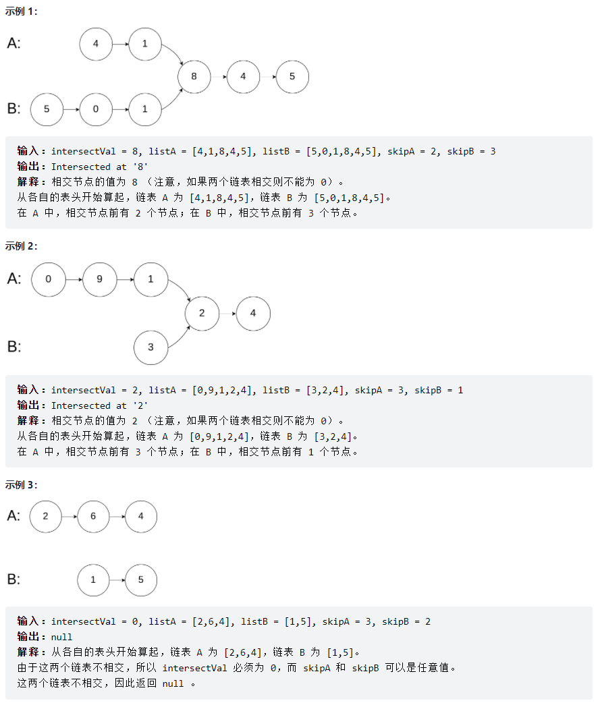
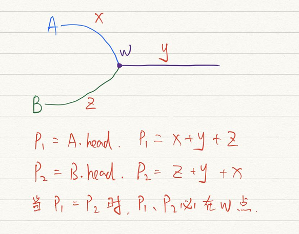

# [剑指offerII023.两个链表的第一个重合节点](https://leetcode-cn.com/problems/3u1WK4/solution/shua-chuan-jian-zhi-offer-day12-lian-bia-m5nz/)
> https://leetcode-cn.com/problems/3u1WK4/solution/shua-chuan-jian-zhi-offer-day12-lian-bia-m5nz/
> 
> 难度：简单

## 题目

给定两个单链表的头节点 headA 和 headB ，请找出并返回两个单链表相交的起始节点。如果两个链表没有交点，返回 null 。
图示两个链表在节点 c1 开始相交：
题目数据 保证 整个链式结构中不存在环。
注意，函数返回结果后，链表必须 保持其原始结构 。
提示：
- listA 中节点数目为 m
- listB 中节点数目为 n
- 0 <= m, n <= 3 * 10 ^ 4
- 1 <= Node.val <= 10 ^ 5
- 0 <= skipA <= m
- 0 <= skipB <= n
- 如果 listA 和 listB 没有交点，intersectVal 为 0
- 如果 listA 和 listB 有交点，intersectVal == listA[skipA + 1] == listB[skipB + 1]

进阶：能否设计一个时间复杂度 O(n) 、仅用 O(1) 内存的解决方案？

## 示例


## 分析

这道题比较容易想到的是，创建一个hash表，然后循环依次A，将A的所有节点添加至Hash表中。
再循环依次B，每次判断B的当前节点是否在hash表中。
代码如下：
```python
class Solution:
    def getIntersectionNode(self, headA, headB):
        d = {}
        while headA:
            d[headA] = headA
            headA = headA.next
        while headB:
            if d.get(headB):
                return headB
            headB = headB.next
        return None
```

这样的思路可以通过，但是题目说了**程序尽量满足 O(n) 时间复杂度，且仅用 O(1) 内存。**
hash表构造了额外的O(n)空间复杂度，那么如何来实现使用O(1)的时间复杂度完成呢？
让我们根据示例1画张草图来分析下：



1. 假设相交前A链表的长度为x,B链表的长度为z
2. 两个链表相交的点为图中的w
3. 相交后共同的长度为y。
4. 我们分别创建p1、p2两个指针指向A、B
5. 当p1或者p2走到头时，则将指针重新指向另外的一个链表。
6. 当p1、p2相等时终止，返回p1或p2就是第一个相交节点。
7. 因为p1、p2走过的路程都是x+y+z！

所以我们可以使用上图的方式，通过双指针的解法，来完成这道题目。

## 解题
**Python:**
```python
class Solution:
    def getIntersectionNode(self, headA, headB):
        x, y = headA, headB
        while x != y:
            x = x.next if x else headB
            y = y.next if y else headA
        return x
```
**Java:**
```java
public class Solution {
    public ListNode getIntersectionNode(ListNode headA, ListNode headB) {
        ListNode p1 = headA;
        ListNode p2 = headB;
        while (p1 != p2){
            p1 = p1 != null?p1.next:headB;
            p2 = p2 != null?p2.next:headA;
        }
        return p1;
    }
}
```

欢迎关注我的公众号: **清风Python**，带你每日学习Python算法刷题的同时，了解更多python小知识。

有喜欢力扣刷题的小伙伴可以加我微信（King_Uranus）互相鼓励，共同进步，一起玩转超级码力！

我的个人博客：[https://qingfengpython.cn](https://qingfengpython.cn)

力扣解题合集：[https://github.com/BreezePython/AlgorithmMarkdown](https://github.com/BreezePython/AlgorithmMarkdown)