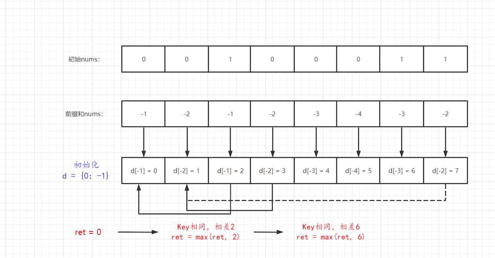

# [525.连续数组](https://leetcode-cn.com/problems/contiguous-array/solution/525lian-xu-shu-zu-qian-zhui-he-hashbiao-riqe2/)
> https://leetcode-cn.com/problems/contiguous-array/solution/525lian-xu-shu-zu-qian-zhui-he-hashbiao-riqe2/
> 
> 难度：中等

## 题目：

给定一个二进制数组 nums , 找到含有相同数量的 0 和 1 的最长连续子数组，
并返回该子数组的长度。

## 示例：

```
示例 1:
输入: nums = [0,1]
输出: 2
说明: [0, 1] 是具有相同数量0和1的最长连续子数组。

示例 2:
输入: nums = [0,1,0]
输出: 2
说明: [0, 1] (或 [1, 0]) 是具有相同数量0和1的最长连续子数组。
```

## 分析

首先想吐槽的是，这用例给的也太敷衍了，开始还以为是需要0、1交替出现呢...
结果遇到一个 [0,0,1,0,0,0,1,1] 的用例猜知道指考虑连续，无需交替。
那么这道题就和题目

[523.连续的子数组和](https://leetcode-cn.com/problems/continuous-subarray-sum/solution/523-lian-xu-de-zi-shu-zu-he-qian-zhui-he-zl78/)

如出一辙了。

同样的我们采用前缀的方式来快速解题，这里要注意0、1的判断在这里需要修改下，如果为0，这设置为-1，
如果为1则认为是它本身，这样当出现相同的0、1数目时，这段数据的总和为0。

配合创建Hash表， 记录{总和 : 下标}， 由于可能存在nums前N数字和刚好满足条件的情况，
我们预制字典{0,-1}来规避该问题。

循环判断是否在字典中存在前缀和一样的键，并不断判断最长符合题意的连续数组，最终返回即可。



## 解题：

```python
class Solution:
    def findMaxLength(self, nums):
        d = {0: -1}
        ret = 0
        pre = 0
        for index, num in enumerate(nums):
            if num == 0:
                pre -= 1
            else:
                pre += 1
            point = d.get(pre, index)
            if point == index:
                d[pre] = index
            else:
                ret = max(ret, index - point)
        return ret
```

欢迎关注我的公众号: **清风Python**，带你每日学习Python算法刷题的同时，了解更多python小知识。

有喜欢力扣刷题的小伙伴可以加我微信（King_Uranus）互相鼓励，共同进步，一起玩转超级码力！

我的个人博客：[https://qingfengpython.cn](https://qingfengpython.cn)

力扣解题合集：[https://github.com/BreezePython/AlgorithmMarkdown](https://github.com/BreezePython/AlgorithmMarkdown)