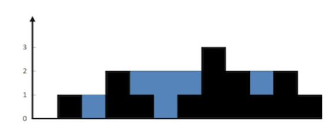

# 面试题 17.21. 直方图的水量

> https://leetcode-cn.com/problems/volume-of-histogram-lcci/
>
> 难度：困难

## 题目：

给定一个直方图(也称柱状图)，假设有人从上面源源不断地倒水，最后直方图能存多少水量?直方图的宽度为 1。
如图：

## 示例：


输入: [0,1,0,2,1,0,1,3,2,1,2,1]

输出: 6

## 分析：

打眼看到这题觉得挺简单的，无非是双指针+栈。但仔细考虑发现，当柱状图的右侧最终没有比你指针的left大时，栈内的数字就没办法回归了。

比如示例中，left = height[7]为3最大，后续没有比这个数再大的边缘，那最后一个水槽就没办法加入总和了。

想了很久，找到一个办法，当栈中存在余数时，我们在栈顶插入一个当前栈内最大的元素，递归再次遍历，直到栈为空。

已示例为例子，第一次执行trap后，由于left为3，后续栈内数值为[2,1,2,1],此时我们向栈底插入一个2，栈就变为了
[2,2,1,2,1]。有些朋友会问，为什么要插入一个而不执行将栈作为下一次循环。举个例子，如果left为3，栈内剩余的是[1,2]，
不插入一个2，而直接将1,2入参，就没办法获取到本该有的1个水槽了！

附上解题与详细注释说明，帮助大家理解

## 解题：

```python
class Solution:
    def trap(self, height):
        left = 0
        right = 1
        total = 0
        stack = []
        # 设置条件当右指针走向尾部终止循环
        while right < len(height):
            # 当存在right指针比left指针的数值大时
            # stack出栈并计算储水数量
            # 最后left指针移动到right指针位置
            if height[right] >= height[left]:
                while stack:
                    total += height[left] - stack.pop()
                left = right
            # 其他场景下将数字入栈
            else:
                stack.append(height[right])
            right += 1
        # 当栈内信息大于1时，开启递归操作
        if len(stack) > 1:
            total += self.trap([max(stack)] + stack)
        return total
```

欢迎关注我的公众号: **清风Python**，带你每日学习Python算法刷题的同时，了解更多python小知识。

有喜欢力扣刷题的小伙伴可以加我微信（King_Uranus）互相鼓励，共同进步，一起玩转超级码力！

我的个人博客：[https://qingfengpython.cn](https://qingfengpython.cn)

力扣解题合集：[https://github.com/BreezePython/AlgorithmMarkdown](https://github.com/BreezePython/AlgorithmMarkdown)
