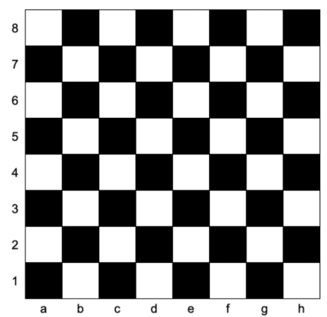

# [1812.判断国际象棋棋盘中一个格子的颜色](https://leetcode-cn.com/problems/determine-color-of-a-chessboard-square/solution/5705-pan-duan-guo-ji-xiang-qi-qi-pan-zho-xuln/)
> https://leetcode-cn.com/problems/determine-color-of-a-chessboard-square/solution/5705-pan-duan-guo-ji-xiang-qi-qi-pan-zho-xuln/
> 
> 难度：简单

## 题目：

给你一个坐标 coordinates ，它是一个字符串，表示国际象棋棋盘中一个格子的坐标。下图是国际象棋棋盘示意图。


如果所给格子的颜色是白色，请你返回 true，如果是黑色，请返回 false 。

给定坐标一定代表国际象棋棋盘上一个存在的格子。坐标第一个字符是字母，第二个字符是数字。



## 示例：

```
示例 1：

输入：coordinates = "a1"

输出：false

解释：如上图棋盘所示，"a1" 坐标的格子是黑色的，所以返回 false 。

示例 2：

输入：coordinates = "h3"

输出：true

解释：如上图棋盘所示，"h3" 坐标的格子是白色的，所以返回 true 。

示例 3：

输入：coordinates = "c7"

输出：false

提示：

coordinates.length == 2
'a' <= coordinates[0] <= 'h'
'1' <= coordinates[1] <= '8'
```

## 分析

首先这道题是棋盘，所以取值范围有限，哪怕一个一个拼也能通过，但如果长宽无限又该怎么做呢？

其实经常有人问，这道题你是怎么想着用什么算法解题的呢，方法如下：

1. 首先你需要先把常用的那些算法掌握了，才能在遇到一道题的时候去想该用什么方法
2. 一定题目数量的积累，能让你遇到同类型题目的几率变大，从而参照历史解法快速解题
3. 培养自己思考、总结的能力，这点就要靠逐步训练了才能在遇到一道题的时候快速明确算法。

那么这道题，由于只有黑、白两种颜色，什么算法的结果只涉及2中结果？没错，就是**异或**操作。

首先,异或操作必须要是数字，那么横坐标我们可以通过ascii将a、b、c...转换为数字。
其次，横纵坐标我们需要都保持在0、1之间方便异或比较，那么将结果取余即可。

左下角coordinates为'a1'转换后为'97 1' 1 ^ 1 = 0 为黑色。
依次类推，'b1' = '98 1' = '0 1' 0 ^ 1 = 1为白色
'a2' = '97 2' = '10' = 1 为白色。

最终，按照现在的规律，两数分别取余在异或，与两数求和后异或结果相同，故此能相加后异或更为简便。

## 解题：

```python
class Solution:
    def squareIsWhite(self, coordinates):
        s,n = coordinates
        # 这里使用if判断结果不为0，则表示True的方式，简化代码
        return True if (ord(s)+ int(n)) % 2 else False 
```

欢迎关注我的公众号: **清风Python**，带你每日学习Python算法刷题的同时，了解更多python小知识。

有喜欢力扣刷题的小伙伴可以加我微信（King_Uranus）互相鼓励，共同进步，一起玩转超级码力！

我的个人博客：[https://qingfengpython.cn](https://qingfengpython.cn)

力扣解题合集：[https://github.com/BreezePython/AlgorithmMarkdown](https://github.com/BreezePython/AlgorithmMarkdown)
