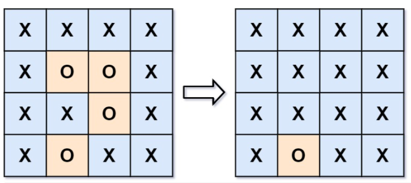

# [130.被围绕的区域](https://leetcode-cn.com/problems/surrounded-regions/solution/130bei-wei-rao-de-qu-yu-shen-du-you-xian-6h6d/)
> https://leetcode-cn.com/problems/surrounded-regions/solution/130bei-wei-rao-de-qu-yu-shen-du-you-xian-6h6d/
> 
> 难度：中等

## 题目

给你一个 m x n 的矩阵 board ，由若干字符 'X' 和 'O' ，
找到所有被 'X' 围绕的区域，并将这些区域里所有的 'O' 用 'X' 填充。

提示：
- m == board.length
- n == board[i].length
- 1 <= m, n <= 200
- board[i][j] 为 'X' 或 'O'

## 示例

```
示例 1：
输入：board = [["X","X","X","X"],["X","O","O","X"],["X","X","O","X"],["X","O","X","X"]]
输出：[["X","X","X","X"],["X","X","X","X"],["X","X","X","X"],["X","O","X","X"]]
解释：被围绕的区间不会存在于边界上，换句话说，任何边界上的 'O' 都不会被填充为 'X'。 任何不在边界上，或不与边界上的 'O' 相连的 'O' 最终都会被填充为 'X'。如果两个元素在水平或垂直方向相邻，则称它们是“相连”的。

示例 2：
输入：board = [["X"]]
输出：[["X"]]
```

## 分析
推荐下矩阵搜索的经典top3题目：
- **[79.单词搜索](https://leetcode-cn.com/problems/word-search/solution/79dan-ci-sou-suo-li-jie-liang-ge-xiao-ke-rh6b/)**
- **[130.被围绕的区域](https://leetcode-cn.com/problems/surrounded-regions/solution/130bei-wei-rao-de-qu-yu-shen-du-you-xian-6h6d/)**
- **[200.岛屿数量](https://leetcode-cn.com/problems/number-of-islands/solution/200dao-yu-shu-liang-ju-zhen-sou-suo-top3-ww71/)**

不得不吐槽下，这种O和0易混淆的字母，能不能不要出现在解题中，手误写错了一个调试了半天。
这道题的突破口就在于：
> 任何不在边界上，或不与边界上的 'O' 相连的 'O' 最终都会被填充为 'X'。

那么，我们只要找到四周边界上存在O且与这些O连接着的O，在搜索时先修改成其他字母，比如“#”。
然后遍历二维矩阵，将为O修改为X，将#修改为O即可。

## 解题

```python
class Solution:
    def solve(self, board):
        row, col = len(board), len(board[0])

        def dfs(x, y):
            if board[x][y] != 'O':
                return
            else:
                 board[x][y] = '#'
            for c in [[0, 1], [0, -1], [1, 0], [-1, 0]]:
                if 0 <= x + c[0] < row and 0 <= y + c[1] < col:
                    dfs(x + c[0], y + c[1])

        for i in range(row):
            dfs(i, 0)
            dfs(i, col - 1)
        for j in range(1, col - 1):
            dfs(0, j)
            dfs(row - 1, j)

        for i in range(row):
            for j in range(col):
                board[i][j] = 'O' if board[i][j] == '#' else 'X'
```

欢迎关注我的公众号: **清风Python**，带你每日学习Python算法刷题的同时，了解更多python小知识。

有喜欢力扣刷题的小伙伴可以加我微信（King_Uranus）互相鼓励，共同进步，一起玩转超级码力！

我的个人博客：[https://qingfengpython.cn](https://qingfengpython.cn)

力扣解题合集：[https://github.com/BreezePython/AlgorithmMarkdown](https://github.com/BreezePython/AlgorithmMarkdown)