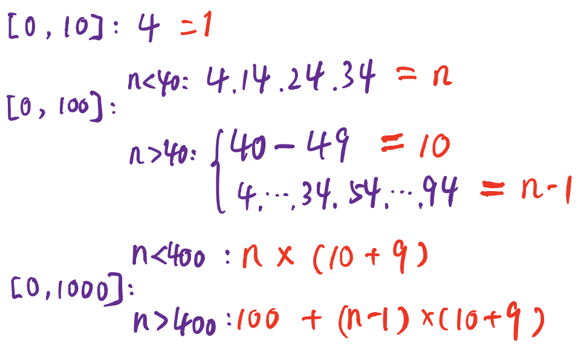

# [01.不喜欢4的司机](https://qingfengpython.cn/#/markdown/Algorithm/_Exam/01.%E4%B8%8D%E5%96%9C%E6%AC%A24%E7%9A%84%E5%8F%B8%E6%9C%BA)

> https://qingfengpython.cn/#/markdown/Algorithm/%E5%8A%9B%E6%89%A3%E7%AE%97%E6%B3%95%E5%88%B7%E9%A2%98%E7%9B%AE%E5%BD%95
>
> 难度：简单

## 题目：

程序员小张打了一辆网约车出去玩，出于职业敏感，他注意到这辆网约车的计价计费偏大。 司机解释说他不喜欢数字4，所以改装了计价器，任何数字位置遇到数字4就直接跳过，其余功能都正常。

比如：

1. 23再多一块钱就变为25；
2. 39再多一块钱变为50；
3. 399再多一块钱变为500；

请你帮小张通过计价器的表面读数，计算真实费用。

输入描述: 只有一行，数字N，表示里程表的读数。(1<=N<=6666666666)。

输出描述: 一个数字，表示实际产生的费用。以回车结束。

## 示例：

```
示例1：
输入：5
输出：4
说明：5表示计价器的表面读数。
4表示实际产生的费用其实只有4块钱。

示例2：
输入：17
输出：15
说明：17表示计价器的表面读数。
15表示实际产生的费用其实只有15块钱。

示例3：
输入：100
输出：81
说明：100表示计价器的表面读数。
81表示实际产生的费用其实只有81块钱。
```

## 分析



```
当 N 小于10， 仅存在 4 满足题意
当 N 大于10后，需要判断当前N次幂下，是否大于4，大于4时，
需要乘以当前幂对应4的数字段，如40、400 等。
根据此关系可初始化:
  k = 0, j = 1 ,tmp = 0, total = n
  当 n > 0，执行循环
  如果 n % 10 大于 4:
    tmp += j + (n % 10 -1) * k
  否则
    tmp += (n % 10) * k
  每次结束后
  k = k * 9 + j
  j *= 10
  n //= 10
  最终
  return total - tmp
```

## 解题：

```python
def solution(n):
    ans = n
    tmp = 0
    k = 0
    j = 1
    while n > 0:
        if n % 10 > 4:
            tmp += j + (n % 10 - 1) * k
        else:
            tmp += (n % 10) * k
        k = k * 9 + j
        j *= 10
        n //= 10
    return ans - tmp
```

欢迎关注我的公众号: **清风Python**，带你每日学习Python算法刷题的同时，了解更多python小知识。

有喜欢力扣刷题的小伙伴可以加我微信（King_Uranus）互相鼓励，共同进步，一起玩转超级码力！

我的个人博客：[https://qingfengpython.cn](https://qingfengpython.cn)

力扣解题合集：[https://github.com/BreezePython/AlgorithmMarkdown](https://github.com/BreezePython/AlgorithmMarkdown)