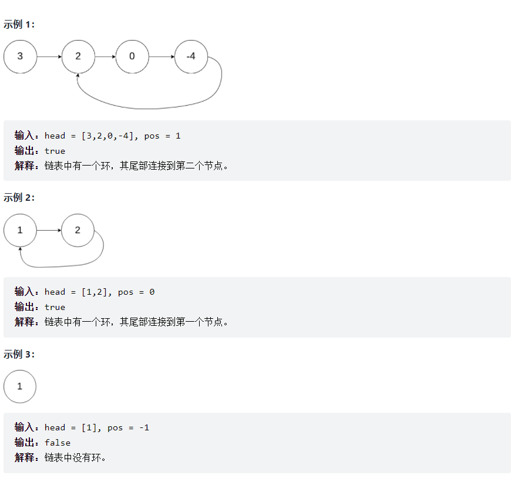

# [141.环形链表](https://leetcode-cn.com/problems/linked-list-cycle/solution/141huan-xing-lian-biao-pythonji-he-yu-ku-1yuu/)
> https://leetcode-cn.com/problems/linked-list-cycle/solution/141huan-xing-lian-biao-pythonji-he-yu-ku-1yuu/
> 
> 难度：简单

## 题目：

给定一个链表，判断链表中是否有环。

如果链表中有某个节点，可以通过连续跟踪 next 指针再次到达，则链表中存在环。 为了表示给定链表中的环，我们使用整数 pos 来表示链表尾连接到链表中的位置（索引从 0 开始）。 如果 pos 是 -1，则在该链表中没有环。注意：pos 不作为参数进行传递，仅仅是为了标识链表的实际情况。

如果链表中存在环，则返回 true 。 否则，返回 false 。

进阶：

你能用 O(1)（即，常量）内存解决此问题吗？

提示：

- 链表中节点的数目范围是 [0, 10^4]
- -10^5 <= Node.val <= 10^5
- pos 为 -1 或者链表中的一个 有效索引 。

## 示例：



## 分析

先考虑常规场景，设置一个set集合，然后开始while循环，条件为head存在。
每次遍历链表都判断是否存在集合内，存在返回True， 不存在则将当前链表加入到集合中。
最终若while循环结束返回False。

如果考虑O1的空间复杂度，上面的解法不就满足了。需要开始快慢指针的场景。
设置初始指针slow = fast = head,
然后slow = slow.next  fast = fast.next.next
即慢的一次走一步，快的一次走两步。如果快的追上了慢的，代码为循环链表。

## 解题1 集合判断：
**Python:**
```python
class Solution:
    def hasCycle(self, head):
        d = set()
        while head:
            if head in d:
                return True
            else:
                d.add(head)
                head = head.next
        return False
```
**Java:**
```java
public class Solution {
    public boolean hasCycle(ListNode head) {
        ListNode li = head;
        HashSet s = new HashSet();
        while (li != null){
            if (s.contains(li)){
                return true;
            }
            s.add(li);
            li = li.next;
        }
        return false;
    }
}
```

## 解题2 快慢指针：
**Python:**
```python
class Solution:
    def hasCycle(self, head):
        if not head or not head.next:
            return False
        slow = fast = head
        while fast and fast.next:
            slow = slow.next
            fast = fast.next.next
            if slow == fast:
                return True
        return False
```
**Java:**
```java
public class Solution {
    public boolean hasCycle(ListNode head) {
        ListNode left = head;
        ListNode right = head;
        while (right != null && right.next != null) {
            left = left.next;
            right = right.next.next;
            if (left == right) {
                return true;
            }
        }
        return false;
    }
}
```

欢迎关注我的公众号: **清风Python**，带你每日学习Python算法刷题的同时，了解更多python小知识。

有喜欢力扣刷题的小伙伴可以加我微信（King_Uranus）互相鼓励，共同进步，一起玩转超级码力！

我的个人博客：[https://qingfengpython.cn](https://qingfengpython.cn)

力扣解题合集：[https://github.com/BreezePython/AlgorithmMarkdown](https://github.com/BreezePython/AlgorithmMarkdown)
