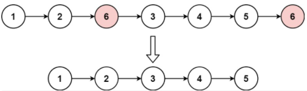
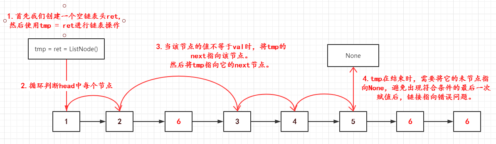

# [203.移除链表元素](https://leetcode-cn.com/problems/remove-linked-list-elements/solution/203yi-chu-lian-biao-yuan-su-tu-jie-lian-u2qii/)
> https://leetcode-cn.com/problems/remove-linked-list-elements/solution/203yi-chu-lian-biao-yuan-su-tu-jie-lian-u2qii/
> 
> 难度：简单

## 题目：

给你一个链表的头节点 head 和一个整数 val ，请你删除链表中所有满足 Node.val == val 的节点，并返回 新的头节点 。

## 示例：

```
示例 1：
输入：head = [1,2,6,3,4,5,6], val = 6
输出：[1,2,3,4,5]

示例 2：
输入：head = [], val = 1
输出：[]

示例 3：
输入：head = [7,7,7,7], val = 7
输出：[]
```

## 分析

1. 首先我们创建一个空链表头ret,然后使用tmp = ret进行链表操作
2. 之后开始循环head链表
3. 当该节点的值不等于val时，将tmp的next指向该节点，然后将tmp指向它的next节点。
4. 这里注意tmp在结束时，需要将它的未节点指向None，避免出现符合条件的最后一次赋值后，链接指向错误问题。




## 解题：

```python
class Solution:
    def removeElements(self, head: ListNode, val: int) -> ListNode:
        tmp = ret = ListNode()
        while head:
            if head.val != val:
                tmp.next = head
                tmp = tmp.next
            head = head.next
        tmp.next = None
        return ret.next
```

欢迎关注我的公众号: **清风Python**，带你每日学习Python算法刷题的同时，了解更多python小知识。

有喜欢力扣刷题的小伙伴可以加我微信（King_Uranus）互相鼓励，共同进步，一起玩转超级码力！

我的个人博客：[https://qingfengpython.cn](https://qingfengpython.cn)

力扣解题合集：[https://github.com/BreezePython/AlgorithmMarkdown](https://github.com/BreezePython/AlgorithmMarkdown)
