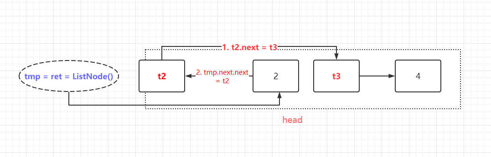

# [24.两两交换链表中的节点](https://leetcode-cn.com/problems/swap-nodes-in-pairs/)
> https://leetcode-cn.com/problems/swap-nodes-in-pairs/
> 
> 难度：中等

## 题目：

给定一个链表，两两交换其中相邻的节点，并返回交换后的链表。

你不能只是单纯的改变节点内部的值，而是需要实际的进行节点交换。

提示：

- 链表中节点的数目在范围 [0, 100] 内
- 0 <= Node.val <= 100

## 示例：

```
示例 1：
输入：head = [1,2,3,4]
输出：[2,1,4,3]

示例 2：
输入：head = []
输出：[]

示例 3：
输入：head = [1]
输出：[1]
```

## 分析





## 解题：

```python
class Solution:
    def swapPairs(self, head):
        ret = ListNode()
        ret.next = head
        tmp = ret
        while tmp.next and tmp.next.next:
            t3 = tmp.next.next.next
            t2 = tmp.next
            tmp.next = tmp.next.next
            tmp.next.next = t2
            t2.next = t3
            tmp = t2
        return ret.next

```

欢迎关注我的公众号: **清风Python**，带你每日学习Python算法刷题的同时，了解更多python小知识。

有喜欢力扣刷题的小伙伴可以加我微信（King_Uranus）互相鼓励，共同进步，一起玩转超级码力！

我的个人博客：[https://qingfengpython.cn](https://qingfengpython.cn)

力扣解题合集：[https://github.com/BreezePython/AlgorithmMarkdown](https://github.com/BreezePython/AlgorithmMarkdown)
